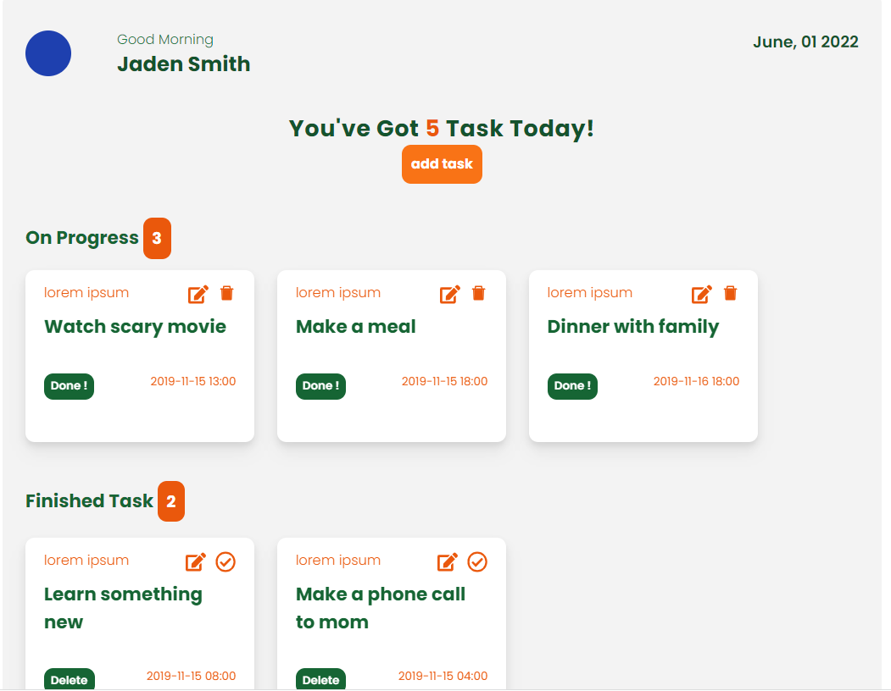

# To do list react



> a complete todo application with CRUD features

- Live site [_https://todolistreact-2.netlify.app/_]

## General Information

- in this project, we create a complete Todo Application with all features. we did all the CRUD operations, we use React.js, tailwind css, and to manage the states we use Redux. hope you enjoy it!

## Technologies Used

- [React.js](https://reactjs.org/) - version 18.1.0
- [TailwindCss](https://tailwindcss.com/) - version 3.0.23

## Built With

- [React Js](https://reactjs.org/) - Next Js simplified HTML, routing and interactions for rapid web development
- [Tailwind Css](https://tailwindui.com/) - simplified to styling, with inline styling
- [React-icons](https://react-icons.github.io/react-icons/search)
- [axios](https://github.com/axios/axios/)
- [moment](https://momentjs.com/)
- [react-redux](https://react-redux.js.org/)
- [redux-thunk](https://github.com/reduxjs/redux-thunk)
- [react-hot-alert](https://sweetalert.js.org/guides/)

## Setup

to run this project, install it locally using npm

```
$ cd ../to-do-list
$ npm install
$ npm run start
```

## Contact

- Created by [akmal](https://github.com/akmalays) - feel free to contact me!
  Happy Coding!
